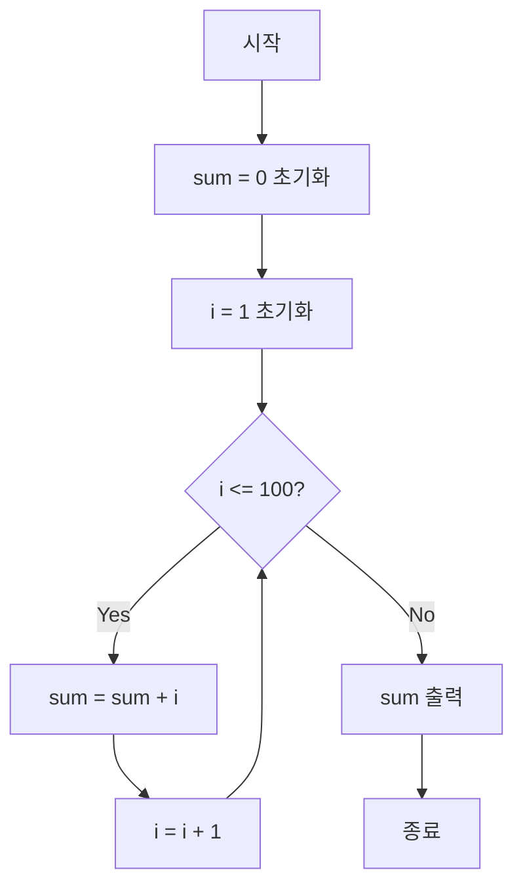

## 반복문이란?

반복문은 특정 코드 블록을 여러 번 실행하도록 하는 프로그래밍 구조이다. 조건에 따라 코드를 반복적으로 실행하거나, 정해진 횟수만큼 실행할 수 있다.


## 🏃 반복문의 필요성(일상 운동 비유)

"팔굽혀펴기 20회 하세요"라는 지시는 사실 반복문과 같다. 명확한 동작(팔굽혀펴기)을 정해진 횟수(20회)만큼 반복하라는 지시이다. 이를 코드로 일일이 쓴다면:

```
팔굽혀펴기 1회
팔굽혀펴기 1회
팔굽혀펴기 1회
...
```

대신 반복문을 사용하면:

```
20회 반복 {
    팔굽혀펴기 1회
}
```

## 프로그래밍에서 반복문의 장점

1. **코드 간결성**: 동일한 코드를 여러 번 작성하는 대신, 한 번 작성하고 반복할 수 있다.
    
    ```
    100개의 별을 출력하려면...
    반복문 없이: * * * * * * * * * ... (100개 별 직접 입력)
    반복문 사용: for(i=0; i<100; i++) { 별 하나 출력 }
    ```
    
2. **유지보수 용이성**: 변경이 필요할 때 반복되는 코드 전체가 아닌 반복문 내부 코드만 수정하면 된다.
    
    ```
    별 대신 하트로 바꾸려면...
    반복문 없이: 100개의 별을 모두 하트로 변경
    반복문 사용: 반복문 내부의 '별' 출력을 '하트' 출력으로 변경
    ```
    
3. **오류 감소**: 똑같은 코드를 여러 번 작성할 때 발생할 수 있는 실수를 줄일 수 있다.
4. **데이터 컬렉션 처리**: 배열, 리스트 등의 여러 데이터를 효율적으로 처리할 수 있다.

# 예제

## 소스 코드

- 1부터 100까지 더하는 프로그램 개발

```java
public class SumOneToHundred {
    public static void main(String[] args) {
        int sum = 0; // 합계를 저장할 변수 초기화
        
        // 1부터 100까지 반복
        for (int i = 1; i <= 100; i++) {
            sum += i; // 현재 숫자를 합계에 더함
        }
        
        // 결과 출력
        System.out.println("1부터 100까지의 합: " + sum);
    }
}
```

이 순서도는 1부터 100까지 합을 구하는 알고리즘의 흐름은 아래와 같다.
```
1. 시작 후 합계 변수 `sum`을 0으로 초기화한다.
2. 반복 변수 `i`를 1로 초기화한다.
3. `i`가 100 이하인지 확인하는 조건을 검사한다.
4. 조건이 참이면 `sum`에 현재 `i` 값을 더한다.
5. `i`를 1 증가시킨다.
6. 다시 조건 검사로 돌아간다.
7. `i`가 100보다 커지면 조건이 거짓이 되어 반복문을 빠져나온다.
8. 최종 `sum` 값을 출력한다.
9. 프로그램이 종료된다.
```


## 순서도



