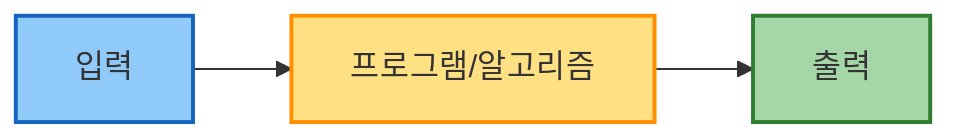
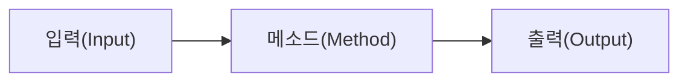

# 프로그램이란?

프로그램은 컴퓨터가 수행해야 할 명령어들의 집합이다. 이는 특정 작업을 수행하거나 문제를 해결하기 위해 논리적으로 구성된 지시사항들로 구성된다. 프로그램은 개발자가 프로그래밍 언어를 사용하여 작성하며, 컴퓨터가 이해할 수 있는 형태로 변환되어 실행된다.

프로그램 기본 구성 요소 다이어그램에 대한 설명을 한다.



1. **입력**: 왼쪽에 있는 사각형은 프로그램이 처리할 데이터를 나타낸다. 예를 들어, 사용자가 키보드로 입력한 텍스트나 파일에서 읽어온 정보 등이 여기에 해당한다.
2. **프로그램(알고리즘)**: 가운데 있는 사각형은 실제 프로그램 또는 알고리즘을 나타낸다. 프로그램을 표현할 때 사각형(네모)을 사용하는 것은 소프트웨어 아키텍처나 시스템 설계에서 매우 일반적인 방식이다. 사각형은 명확한 경계를 가진 독립적인 단위를 시각적으로 잘 표현하기 때문에 프로그램 구성 요소를 표현하는 데 적합하다. 여러분이 앞으로 공부하면서 다양한 소프트웨어 다이어그램이나 시스템 아키텍처를 볼 때도 대부분 프로그램 모듈이나 컴포넌트는 사각형으로 표현된 것을 볼 수 있다.
3. **출력**: 오른쪽에 있는 사각형은 프로그램이 처리한 결과를 나타낸다. 예를 들어, 화면에 표시되는 정보나 파일로 저장되는 데이터 등이 여기에 해당한다.

화살표는 데이터의 흐름을 나타내며, 왼쪽에서 오른쪽으로 진행한다. 즉, 입력 데이터가 프로그램에 의해 처리되고, 그 결과가 출력으로 나온다는 기본적인 컴퓨팅 과정을 보여준다.

이런 방식으로 사각형과 화살표를 사용해 프로그램의 구조와 흐름을 시각화하면, 복잡한 시스템도 이해하기 쉽게 단순화할 수 있다. 프로그래밍을 배우기 시작하는 단계에서는 이러한 기본 구조를 이해하는 것이 중요하다.

# 기본 구성 요소

알고리즘은 문제를 해결하기 위한 단계별 절차이며, 프로그래밍 언어로 구현될 때 구체적인 코드로 변환된다. 제시된 자바 코드를 알고리즘의 관점에서 살펴보면 다음과 같다.

- [IntelliJ](../../Utils/IntelliJ.md)에서 프로젝트를 생성하면 아래와 같이 기본 소스가 생성된다.
```Java
public class Main {
    public static void main(String[] args) {
        System.out.printf("Hello and welcome!");
        for (int i = 1; i <= 5; i++) {
            System.out.println("i = " + i);
        }
    }
}
```

이 코드는 다음과 같은 알고리즘 구성요소를 포함한다.

1. **클래스(사각형으로 표현)**: `Main` 클래스는 프로그램의 구조를 정의한다. 다이어그램에서 이 클래스는 하나의 사각형으로 표현된다. 클래스는 관련 데이터와 기능을 캡슐화하는 객체지향 프로그래밍의 기본 단위이다.
2. **메소드(사각형으로 표현)**: `main` 메소드는 프로그램의 진입점이며, 특정 기능을 수행하는 알고리즘의 일부이다. 소프트웨어 설계 다이어그램에서 메소드도 사각형 안에 표현되거나 별도의 사각형으로 표현된다.
3. **입력**: 이 코드에서 명시적인 입력은 없지만, `String[] args` 매개변수를 통해 명령줄 인수를 받을 수 있다. 입력은 알고리즘이 처리할 초기 데이터이다.
4. **처리 과정**: 이 코드의 알고리즘은 다음의 단계를 포함한다:
    - "Hello and welcome!" 메시지 출력
    - 1부터 5까지 반복하면서 각 숫자 출력
    - 이 반복은 `for` 루프를 통해 구현되며, 이는 알고리즘에서 반복 구조의 예시이다.
5. **출력**: 코드의 출력은 콘솔에 표시되는 텍스트이다.
    
```
Hello and welcome!i = 1
i = 2
i = 3
i = 4
i = 5
```

다이어그램에서 알고리즘의 구성요소를 표현할 때, 클래스 `Main`과 메소드 `main()`은 모두 사각형으로 표현된다. 클래스 사각형 안에 메소드 사각형이 포함될 수 있으며, 이는 메소드가 클래스에 속함을 시각적으로 나타낸다. 이처럼 사각형을 사용한 표현은 소프트웨어 구성요소 간의 계층 구조와 관계를 명확하게 보여준다.

이 간단한 자바 코드는 입력을 받아 처리하고 출력을 생성하는 알고리즘의 기본 구조를 따르며, 객체지향 프로그래밍에서 클래스와 메소드라는 사각형 구성요소로 구현된다.


## #클래스 

- 클래스(class)는 자바와 같은 객체 지향 언어의 기본적인 빌딩 블록
- 클래스들이 모여서 하나의 자바 프로그램
- 자바에서 소스 파일 이름은 항상 public이 붙은 클래스의 이름과 동일해야 함

> [!NOTE] 참고
자바에서는 소스 파일 이름과 클래스 이름이 상당한 관련이 있다. 일단 하나의 소스 파일 안에는 하나의 클래스만 있는 것이 바람직하다. 하지만 하나의 소스 파일에는 여러 개의 클래스가 들어 있을 수 있다. 
> - 소스 안에 public 클래스가 하나 있다면 반드시 소스 파일의 이름은 public 클래스의 이름과 일치하여야 한다(단, 다른 클래스는 public 클래스가 아니어야 한다) .
> - 만약 하나의 소스 파일 안에 public 클래스가 없다면, 소스 파일 안에 포함된 어떤 클래스의 이름으로 하여도 상관없다.
> - 하나의 소스 파일 안에 public 클래스가 2개 이상 있으면 컴파일 오류가 발생한다.
> 


## #메소드 

- 메소드(method)는 특정한 작업을 수행하는 코드의 묶음
- 메소드는 클래스 안에 정의된 함수





```Java
public class Main {
    public static void main(String[] args) {
        문장1
        문장2
        문장N
        }
    }
}
```

- `public`: 누구나 호출 가능"이라는 접근 제어자
- `static`: 정적 메소드이다"를 나타내는 키워드
- `void`: 결과값을 반환하지 않음"을 의미하는 반환 타입
- `main`: 메소드 이름
- `String[] args`: 외부에서 주어지는 데이터를 받는 매개 변수
- 하나의 메소드 안 에는 여러 개의 문장이 포함

### #문장

- 사용자가 컴퓨터에게 작업을 지시하는 단위
- 문장은 프로그램을 이루는 가장 기초적인 단위

```Java
		...
		sum = x + y;
		...
```

### #주석

- 소스 코드가 하는 일을 설명하는 설명글
- 프로그램의 실행 결과에 영향이 없음

```Java
		/* 
			text1
			text2		
		*/
		// 여러 줄을 주석 처리할 때 사용
		
		// text
		//에서 줄의 끝까지 주석(한 줄 주석)
		
```


