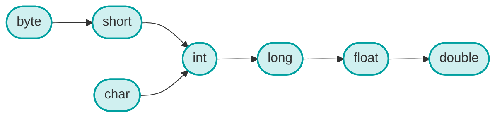

# #형변환 이란?

- 컴퓨터에서 산술 연산(더하기, 빼기, 곱하기, 나누기 등)을 할 때는 중요한 규칙이 있다.

# 형변환 방법
## 자동형변환
- 연산에 사용되는 값들의 타입(자료형)이 같아야 한다.
- 예들 들어, 두 개의 숫자를 더할 때, 컴퓨터는 이 숫자들이 같은 종류여야 계산할 수 있다.
	- `정수 + 정수`는 계산이 가능하다.
	- `실수 + 실수`도 계산이 가능하다.
	- `정수 + 실수`도 계산은 어떻게 될까?
		- `정수 + 실수`처럼 다른 타입의 값을 연산할 때, 컴퓨터는 자동으로 하나의 타입을 다른 타입으로 변환한 후 계산한다.
- 따라서, 컴퓨터는 **자동으로 작은 타입을 큰 타입으로 변환**한다.

```java
int num1 = 5;       // 정수
double num2 = 2.5;  // 실수
double result = num1 + num2;  // 정수 5가 실수 5.0으로 자동 변환된 후 계산됨
```


### 자동형 변환 순서




### 강제적 형변환


```java
int x = 3;
double y = (double) x;
```

# 형변환 시 주의점

## (1) 작은 타입에서 큰 타입으로 변환(자동 형변환)

- 데이터 손실 없이 안전하게 변환됩니다.
- 예: `int → long`, `float → double`

```java
int num = 100; long bigNum = num; // int에서 long으로 자동 형변환
```

## (2) 큰 타입에서 작은 타입으로 변환(명시적 형변환)

- 데이터 손실 가능성이 있어 주의가 필요합니다.
- 캐스팅 연산자 `(type)`를 사용해야 합니다.

### 주요 주의 사항:

1. **실수(double, float)에서 정수(int, long)로 변환**
    - 소수점 이하가 **모두 잘려나갑니다** (반올림이 아닌 버림)

```java
double pi = 3.141592; int intPi = (int)pi; // 결과: 3 (소수점 이하 손실)
```
    
2. **큰 정수에서 작은 정수로 변환**
    - 상위 비트가 잘려나가 값이 완전히 달라질 수 있습니다.   

```java
int big = 1000; byte small = (byte)big; // 결과: -24 (오버플로우 발생)
```

	
3. **char와 숫자 타입 간의 변환**    
    - char는 유니코드 값으로 변환됩니다.
        
```
char ch = 'A'; int code = ch; // 결과: 65 (A의 유니코드 값) int num = 66; char letter = (char)num; // 결과: 'B'
```

4. **boolean 타입은 다른 타입으로 변환 불가**
    - boolean은 true/false만 가질 수 있고 다른 타입과 변환되지 않습니다.