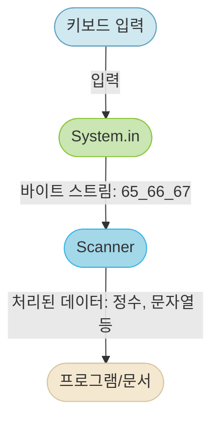
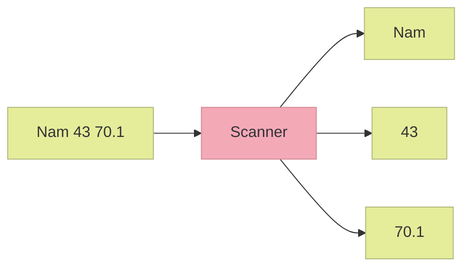

# 개요
- 아래 그림은 자바에서 키보드 입력이 처리되는 과정을 보여준다




- **키보드 입력**
	- 사용자가 키보드로 문자나 숫자를 입력하는 첫 단계이다.
- **System.in**
	- 키보드 입력은 자바의 표준 입력 스트림인 System.in으로 전달된다. 
	- 이 단계에서는 입력된 데이터가 바이트 단위로 처리된다. 
	- 예를 들어, 문자 'A', 'B', 'C'는 각각 아스키 코드값 65, 66, 67의 바이트로 표현된다.
- #Scanner
	- System.in이 제공하는 바이트 스트림을 Scanner 객체가 받아서 처리한다.
	- Scanner는 이 바이트들을 분석하여 정수, 문자열, 실수 등 프로그래밍에 사용하기 편리한 데이터 타입으로 변환한다.
- **프로그램/문서**
	- 마지막으로, Scanner가 변환한 데이터는 #변수 에 저장한다.


# 콘솔에서 입력 받는 방법

- 콘솔에서 읽는 것은 System.in을 사용한다. 
	- System.in은 키보드에서 바이트를 읽어서 우리에게 전달한다.
- 사용 예
```java
import java.util.Scanner;
Scanner sc = new Scanner(System.in);
```


- 실습

```java
import java.util.Scanner;

public class InputNum1 {
   public static void main(String args[]) {
       Scanner sc = new Scanner(System.in);
       int num;
       
       System.out.print("숫자를 입력하시오: ");
       num = sc.nextInt();
       
       System.out.println(num);
   }
}
```


- 연습문제
	- num1과 num2를 입력 받고 그 수를 더한 결과를 출력하시오.


> [!IMPORTANT] 컴퓨터 실행 순서
> 키보드 입력 < SSD < RAM < CPU
> 프로그램 개발 시 키보드 입력은 가장 마지막에 처리하는 것이 빠르다.


# 입력 파라미터로 입력 받는 방법

- [IntelliJ](../../Utils/IntelliJ.md) 내에 작성된 내용 확인

# Scanner 클래스

- Scanner 클래스는 키보드로부터 바이트 값을 받아서 분리자를 이용하여 각 바이트들을 토큰(token)으로 분리한다.
- 특별한 지정이 없으면 분리자는 공백문자(‘ ’, ‘\n’, ‘\t’)이다.




```java
String name = sc.next(); // 한 단어(토큰) "Kim"을 읽는다.
int age = sc.nextInt(); // 문자열 "20"을 정수 20으로 변환하여 반환한다.
double weight = sc.nextDouble(); // 문자열 "84.0"을 실수 84.0으로 변환하여 반환한다.
String line = sc.nextLine(); // 문자열 "Kim 20 84.0"이 반환된다.
```
