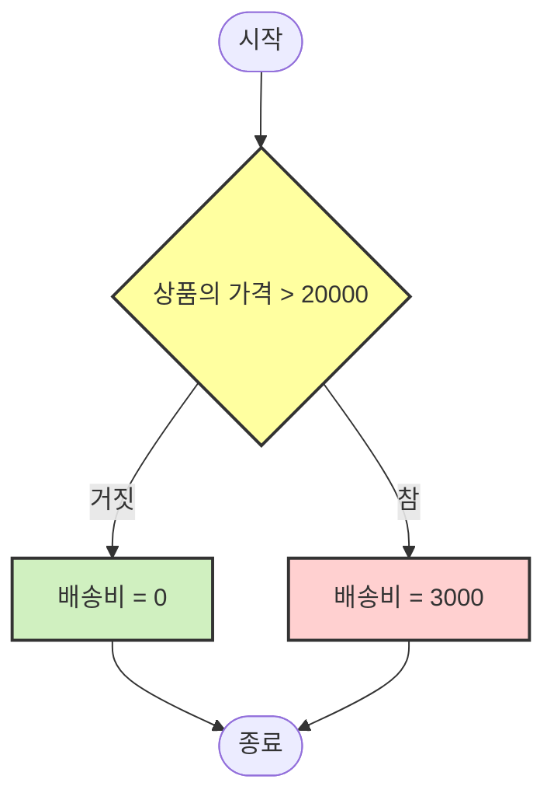

# 컴퓨터 2진수 체계

컴퓨터는 근본적으로 2진수 체계, 즉 0과 1만을 사용하는 이진 논리에 기반하여 작동한다. 이 특성이 조건문을 가능하게 하는 핵심 요소이다. 컴퓨터에서 모든 조건은 궁극적으로 참(true, 1) 또는 거짓(false, 0)으로만 평가된다.

이진 논리의 특징은 중간 상태가 존재하지 않는다는 점이다. 컴퓨터에게 어떤 조건은 항상 참이거나 거짓이며, "조금 참" 또는 "거의 거짓"과 같은 애매모호한 중간 상태는 없다. 이것이 사람의 판단과 가장 큰 차이점이다.

사람은 상황에 따라 "아마도", "어쩌면", "대체로"와 같은 불확실성을 가진 판단을 내릴 수 있다. 예를 들어, "오늘 날씨가 조금 흐리니까 우산을 가져갈까 말까" 하는 고민을 할 수 있다. 또한 감정적 요소나 직관에 의존하여 판단하기도 한다.

반면 컴퓨터는 조건문에서 명확히 정의된 기준에 따라 항상 결정적인 판단을 내린다.

```java
int currentHour = 12;

if (currentHour == 12) {
    System.out.println("점심을 먹는다.");
} else {
    System.out.println("다른 활동을 한다.");
}
```

컴퓨터는 위 조건을 평가할 때 현재 시간이 정확히 12시인지 아닌지만 판단한다. 현재 시간이 12시이면 조건은 참(true)이 되어 "점심을 먹는다"가 실행되고, 11시 59분이나 12시 1분처럼 12시가 아닌 모든 경우에는 조건이 거짓(false)이 되어 "다른 활동을 한다"가 실행된다.

이는 사람의 판단과 크게 다르다. 사람은 "점심시간"을 11시 30분부터 1시까지와 같이 유연하게 해석할 수 있다. "배가 고픈데 11시 50분이니까 조금 일찍 점심을 먹어볼까?"라고 생각하거나, "지금 회의 중이라 12시가 지났지만 회의가 끝나면 점심을 먹어야지"와 같은 상황적, 감정적 판단을 할 수 있다.

하지만 컴퓨터에게는 이런 애매모호함이 없다. 12시가 아니면 무조건 다른 활동을 하게 된다.


# if-else 문(예-아니오 사고법)

if-else 문은 프로그램이 "만약 이 조건이 맞다면 이 일을 하고, 그렇지 않으면 저 일을 해라"라고 결정하는 방법이다. 일상생활에서 우리가 결정을 내리는 방식과 매우 비슷하다.
기본 개념

- **조건에 따른 선택**: if-else 문은 프로그램에게 "이 조건이 맞니?"라고 물어본 후, 답변에 따라 다른 행동을 하도록 지시한다. 예를 들어, "시간이 12시니? 맞으면 점심을 먹고, 아니면 다른 일을 해."와 같다.
- **둘 중 하나만 실행**: if와 else 부분은 둘 다 실행되지 않거나 둘 다 실행되는 경우는 없다. 항상 둘 중 하나만 실행된다. 마치 갈림길에서 왼쪽이나 오른쪽으로만 갈 수 있는 것처럼.
- **조건은 항상 예/아니오로 대답**: 프로그램에서 조건은 항상 "예(true)" 또는 "아니오(false)"로만 대답한다. "아마도" 같은 중간 답변은 없다.

```java
if (시간 == 12) {
    System.out.println("점심을 먹는다.");
} else {
    System.out.println("다른 일을 한다.");
}
```

이 코드는 다음과 같이 읽을 수 있다.
- "만약 시간이 12시라면, '점심을 먹는다'를 출력해라."
- "그렇지 않다면, '다른 일을 한다'를 출력해라."


### 실생활 예

온라인 쇼핑몰에서 배송비 정책을 이해하는 것은 if-else 조건문을 완벽하게 보여주는 실생활 예시이다.

쿠0에서 쇼핑을 할 때를 상상해보세요. 쿠0은 로켓배송이라는 서비스를 제공하며, 일정 금액 이상 구매하면 무료 배송을 해줍니다.




**결제 화면에서 일어나는 일**

- 장바구니에 물건을 담고 결제 페이지로 이동한다.
- 시스템은 자동으로 "총 주문 금액이 20,000원을 넘는가?"라는 조건을 검사한다.
- 만약 19,800원어치를 담았다면, 시스템은 "조건 거짓, 배송비 3,000원 추가"라고 판단한다.
- 만약 23,500원어치를 담았다면, 시스템은 "조건 참, 배송비 0원"이라고 판단한다.

이런 방식으로, 온라인 쇼핑몰의 배송비 정책은 컴퓨터 프로그래밍의 if-else 구조와 정확히 일치한다. 우리가 일상에서 경험하는 많은 서비스들이 이러한 조건문 로직을 기반으로 작동하고 있다.


### 실습 문제

- [Practice_6-1](../Week_06/practice/Practice_6-1.md)
