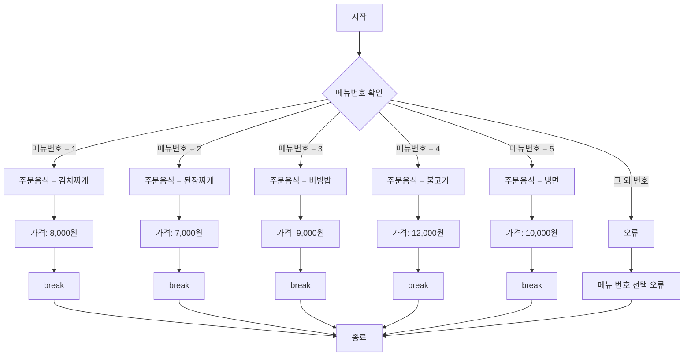
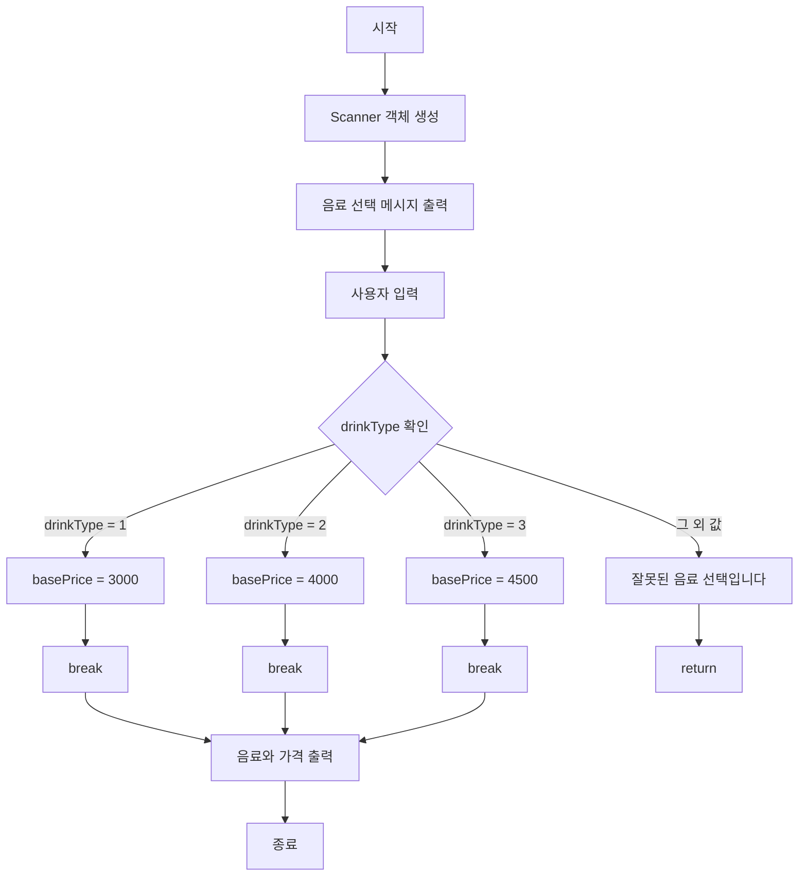

# 개요

- 선택 조건문인 switch문은 하나의 변수나 표현식의 값에 따라 여러 실행 경로 중 하나를 선택하는 제어 구조이다.

## 적합한 사용 상황

- 단일 변수나 표현식이 가질 수 있는 여러 값에 따라 다른 작업을 수행할 때
- 메뉴 선택, 상태 코드 처리, 명령어 해석 등과 같이 명확한 선택지가 있는 경우
- 코드의 가독성과 유지보수성을 높이고 싶을 때

## 사용 예시

### 다중 조건문의 예

```java
// 식당에서 메뉴 번호로 주문하는 상황

int 메뉴번호 = 3; // 예시로 3번 메뉴를 선택했다고 가정
String 주문음식;
int 가격 = 0;

if (메뉴번호 == 1) {
    주문음식 = "김치찌개";
    가격 = 8000;
} else if (메뉴번호 == 2) {
    주문음식 = "된장찌개";
    가격 = 7000;
} else if (메뉴번호 == 3) {
    주문음식 = "비빔밥";
    가격 = 9000;
} else if (메뉴번호 == 4) {
    주문음식 = "불고기";
    가격 = 12000;
} else if (메뉴번호 == 5) {
    주문음식 = "냉면";
    가격 = 10000;
} else {
    System.out.println("메뉴 번호 선택 오류");
    System.exit(0); // 프로그램 종료
}
```

### 선택 조건문

```java
int 메뉴번호 = 3;
String 주문음식;

// switch로 구현한 메뉴 주문 시스템 (깔끔하고 명확함)
switch (메뉴번호) {
    case 1:
        주문음식 = "김치찌개";
        가격 = 8000;
        break;
    case 2:
        주문음식 = "된장찌개";
        가격 = 7000;
        break;
    case 3:
        주문음식 = "비빔밥";
        가격 = 9000;
        break;
    case 4:
        주문음식 = "불고기";
        가격 = 12000;
        break;
    case 5:
        주문음식 = "냉면";
        가격 = 10000;
        break;
    default:
        System.out.println("메뉴 번호 선택 오류");
        System.exit(0); // 프로그램 종료
}
```

이 예시는 실제 식당에서 메뉴판을 보고 번호로 주문하는 상황과 유사하다. switch문은 마치 잘 정리된 메뉴판처럼 각 선택지(메뉴)가 명확하게 구분되어 있어, 코드를 읽는 사람이 한눈에 어떤 선택지가 있는지 파악할 수 있다.

특히 메뉴가 많아질수록 if-else if는 계속 길어지고 복잡해지지만, switch문은 구조적으로 깔끔하게 유지된다. 또한 메뉴 추가/변경 시에도 switch문에서는 해당 case만 추가하거나 수정하면 되어 유지보수가 쉽다.

### 선택 조건문 순서도



# 카페 음료 계산하는 프로그램

- [Practice_7-2](../Week_07/practice/Practice_7-2.md)에서의 일부 코드를 선택 조건문으로 변환

## 소스 코드
```java
import java.util.Scanner;
public class CoffeePriceCalculator {
    public static void main(String[] args) {
        Scanner scanner = new Scanner(System.in);
        
        System.out.println("음료를 선택하세요: 1-아메리카노, 2-카페라떼, 3-카푸치노");
        int drinkType = scanner.nextInt();
        
        int basePrice = 0;
        
        // 음료 종류에 따른 기본 가격 설정 (switch문으로 변경)
        switch (drinkType) {
            case 1:
                basePrice = 3000; // 아메리카노
                break;
            case 2:
                basePrice = 4000; // 카페라떼
                break;
            case 3:
                basePrice = 4500; // 카푸치노
                break;
            default:
                System.out.println("잘못된 음료 선택입니다.");
                return;
        }
		
		// 선택한 음료와 가격 출력
		System.out.println(drinkName + "의 가격은 "원 입니다.");
    }
}
```

## 순서도




> [!NOTE] 실습문제
> [Practice_9-3](../Week_09/practice/Practice_9-3.md): '카페 음료 가격 계산하는 프로그램 개발' 선택 조건문(switch)으로 변경하시오.
