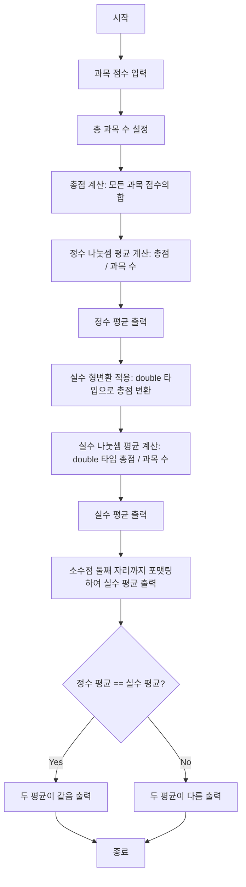

# # (실습문제3) 성적처리 프로그램을 개발하시오.

# 1. 요구사항

- **목적**: 학생 성적 처리 및 자료형 형변환의 영향 분석
- **입력 데이터**: 국어, 영어, 수학, 과학 과목의 점수
- **처리 요구사항**:
    - 모든 과목의 총점 계산
    - 정수 나눗셈을 사용한 평균 계산(형변환 없음)
    - 실수 형변환을 사용한 정확한 평균 계산
    - 두 평균값의 논리적 비교
- **출력 요구사항**:
    - 총점 표시
    - 정수 나눗셈 평균 표시
    - 실수 나눗셈 평균 표시(일반 출력 및 소수점 둘째 자리 포맷팅)
    - 두 평균값의 비교 결과 표시
	
# 2. 설계

## 순서도



## 한글 코딩

```
1. 국어 점수를 85점으로 설정한다.
2. 영어 점수를 92점으로 설정한다.
3. 수학 점수를 78점으로 설정한다.
4. 과학 점수를 95점으로 설정한다.
5. 과목 수를 4로 설정한다.
6. 총점을 계산하기 위해 국어, 영어, 수학, 과학 점수를 모두 더한다.
7. 정수 나눗셈을 사용하여 평균을 계산한다(총점을 과목 수로 나눈다).
8. "=== 형변환 없는 평균 계산 ===" 메시지를 출력한다.
9. "총점: "과 함께 계산된 총점을 출력한다.
10. "정수 나눗셈 평균: "과 함께 계산된 정수 평균을 출력한다.
11. 실수 형변환을 사용하여 정확한 평균을 계산한다(총점을 실수로 변환한 후 과목 수로 나눈다).
12. "\n=== 형변환을 사용한 평균 계산 ===" 메시지를 출력한다.
13. "실수 나눗셈 평균: "과 함께 계산된 실수 평균을 출력한다.
14. 소수점 둘째 자리까지 포맷된 실수 평균을 출력한다.
15. "\n=== 자료형 논리 비교 ===" 메시지를 출력한다.
16. 정수 평균과 실수 평균이 같은지 비교한 결과를 출력한다.
17. 실수 평균이 80 이상인지 확인하여 합격 여부를 결정한다.
18. "평균 80점 이상 합격 여부: "와 함께 합격 또는 불합격 결과를 출력한다.
```


# 3. 개발

## 한글 코드

```
정수 국어 = 85;
정수 영어 = 92;
정수 수학 = 78;
정수 과학 = 95;

// 1. 정수 나눗셈으로 평균 계산 (소수점 손실)
정수 과목수 = 4;
정수 총점 = 국어 + 영어 + 수학 + 과학;
정수 정수평균 = 총점 / 과목수;

출력("=== 형변환 없는 평균 계산 ===");
출력("총점: " + 총점);
출력("정수 나눗셈 평균: " + 정수평균);

// 2. 형변환을 사용한 정확한 평균 계산
실수 실수평균 = (실수) 총점 / 과목수;

출력("\n=== 형변환을 사용한 평균 계산 ===");
출력("실수 나눗셈 평균: " + 실수평균);
서식출력("소수점 둘째 자리까지: %.2f\n", 실수평균);

// 3. 자료형 논리 비교
출력("\n=== 자료형 논리 비교 ===");

// 정수형과 실수형 평균 비교
출력("정수평균 == 실수평균? " + (정수평균 == 실수평균));

// 추가 비교
논리 합격여부 = 실수평균 >= 80;
출력("평균 80점 이상 합격 여부: " + (합격여부 ? "합격" : "불합격"));
```

# [실습문제 제출](../../../Notice/실습문제%20제출.md)

- 이미지 : 실행 결과 화면 캡쳐
- 비고 : 소스 코드 복붙