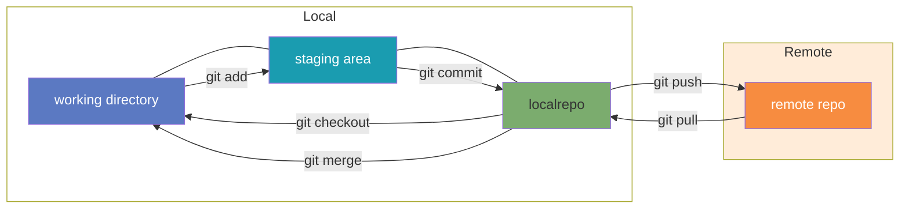

# Git의 기본 개념

## 개념
Git은 분산 버전 관리 시스템(Distributed Version Control System, DVCS)으로, 소프트웨어 개발 과정에서 발생하는 소스 코드의 변경사항을 추적하고 관리하기 위해 설계되었습니다.

### 핵심 특징

1. **분산형 구조**: 중앙 서버에 의존하지 않고 개발자마다 전체 저장소의 복사본을 로컬에 가지고 있어, 오프라인 상태에서도 작업이 가능합니다.
2. **변경 이력 추적**: 파일의 변경 내용을 시간 순서대로 기록하여 과거 버전으로 돌아가거나 변경 내용을 비교할 수 있습니다.
3. **브랜치 기능**: 독립적인 작업 공간을 생성하여 메인 코드에 영향을 주지 않고 새로운 기능을 개발할 수 있습니다.
4. **병합 기능**: 서로 다른 브랜치에서 개발된 코드를 하나로 통합할 수 있습니다.

### 사용 목적

- 소스 코드의 변경사항 추적
- 여러 개발자 간의 협업 용이
- 코드의 백업 및 복원
- 실험적 기능 개발 시 안전성 보장
- 프로젝트의 개발 역사 및 문서화

### Git 사용 비유

- 2025년 3월 9일 기준
	
	출처 : https://openhub.net/repositories/compare

- Git이 나오기 전에는 [SVN](SVN.md)을 사용함

## 그림으로 보는 Git

### Git 기본 명령어

- **원격 저장소(Remote Repository)** - 최상단
    - 팀원들과 공유하는 중앙 저장소
    - 원격 저장소는 [Github](Github.md) 활용
- **로컬 저장소(Local Repository)**
    - 개인 컴퓨터에 저장된 Git 데이터베이스
- **스테이징 영역(Staging Area)**
    - 다음 커밋에 포함될 변경사항을 준비하는 영역
- **작업 디렉토리(Working Directory)** - 최하단
    - 실제 파일을 편집하고 작업하는 공간

### 주요 명령어와 데이터 흐름

- **로컬에서 원격으로**:
    - `git push`: 로컬 저장소의 커밋을 원격 저장소로 업로드 (상향 화살표)
- **원격에서 로컬로**:
    - `git pull`: 원격 저장소의 변경사항을 로컬 저장소로 다운로드 (하향 화살표)
- **로컬 작업 흐름**:
    - `git add`: 작업 디렉토리에서 스테이징 영역으로 이동 (상향 화살표)
    - `git commit`: 스테이징 영역에서 로컬 저장소로 저장 (상향 화살표)
    - `git checkout`: 로컬 저장소에서 작업 디렉토리로 가져오기 (하향 화살표)
    - `git merge`: 로컬 저장소에서 작업 디렉토리로 변경사항 통합 (하향 화살표)

## 축구로 이해하기
### 1. 팀 창단 및 훈련장 설정 = 저장소 초기화

- **메인 브랜치(Main Branch)**: 경기장의 실제 필드와 같습니다. 여기서는 완벽하게 준비된 전술만 사용됩니다.
- **로컬 저장소**: 각 선수가 가진 개인 훈련 공간으로, 자신만의 기술을 연습하는 곳입니다.
- `git init`: 새로운 축구팀을 창단하는 것과 같습니다.
- `git clone`: 기존 팀의 전술과 훈련 방식을 배우기 위해 프로 팀의 훈련을 참관하는 것과 같습니다.

### 2. 개인 기술 연습 = 변경사항 작업

- **작업 디렉토리**: 선수들이 각자 새로운 드리블 기술이나 패스 전술을 연습하는 공간입니다.
- `git add`: 코치에게 자신이 연습한 기술을 보여주기 위해 준비하는 단계입니다.
- **스테이징 영역(Staging Area)**: 코치가 선수의 기술을 평가하기 위한 미니 시연 공간입니다.

### 3. 전술 확정 = 커밋

- `git commit`: 코치가 선수의 기술을 팀 전술책에 추가하는 것과 같습니다. 이제 이 기술은 팀의 공식 전술이 됩니다.
- 각 커밋은 전술책의 한 페이지로, 특정 기술이나 전략이 언제, 누구에 의해 개발되었는지 기록합니다.

### 4. 병렬 전술 개발 = 브랜치

- **브랜치(Branch)**: 다양한 전술을 동시에 개발하기 위한 별도의 훈련 그룹입니다.
- `git branch`: 공격 전술팀, 수비 전술팀, 세트피스 전술팀처럼 목적에 따른 훈련 그룹을 만듭니다.
- `git checkout`: 한 전술 그룹에서 다른 그룹으로 이동하는 것입니다.

### 5. 전술 통합 = 병합

- `git merge`: 공격팀이 개발한 전술과 수비팀이 개발한 전술을 하나의 종합 전략으로 통합하는 과정입니다.
- **충돌(Conflict)**: 공격과 수비의 전술이 서로 맞지 않을 때 발생합니다. 코치가 중재하여 어떤 전술을 채택할지 결정해야 합니다.

### 6. 다른 팀과의 협력 = 원격 저장소

- **원격 저장소(Remote Repository)**: 여러 코치와 선수들이 공유하는 중앙 전술 데이터베이스입니다.
- `git push`: 자신이 개발한 새로운 프리킥 전술을 팀의 공식 전술북에 등록하는 것입니다.
- `git pull`: 다른 코치나 선수들이 개발한 최신 전술을 자신의 훈련에 반영하기 위해 가져오는 것입니다.

### 7. 경기 준비 = 브랜치 전략

- **Feature Branch**: 새로운 공격 패턴을 개발하는 전문 코치와 같습니다.
- **Develop Branch**: 연습 경기에서 시험할 모든 전술을 모아놓은 임시 전술북입니다.
- **Release Branch**: 다가오는 중요 경기를 위해 최종 점검 중인 전술들의 집합입니다.
- **Hotfix Branch**: 경기 중 발견된 전술적 약점을 신속하게 수정하는 긴급 대응팀입니다.

### 8. 과거 전술 검토 = 이력 탐색

- `git log`: 지난 시즌 동안 개발된 모든 전술의 기록을 검토하는 것입니다.
- `git checkout <이전 커밋>`: 과거 경기에서 사용했던 특정 전술로 돌아가 분석하는 것입니다.

### 결론

Git은 축구팀이 전술을 개발하고, 연습하고, 실전에 적용하는 과정과 매우 유사합니다. 각 선수(개발자)는 개인 기술을 연마하고, 이를 팀 전술(프로젝트)에 통합하며, 코치(팀 리더)는 이 모든 과정을 조율합니다. Git을 잘 활용하면 여러분의 프로젝트도 우승 트로피를 들어올리는 축구팀처럼 성공적인 결과를 만들어낼 수 있을 것입니다.

# Git 설치

1. 아래 URL에 접속한다.
    [https://git-scm.com/](https://docs.google.com/document/d/1dNOG7MKMEiXdMuunOGsYU5Uby9MwOyhnfz1xH61-Yzc/edit?usp=drivesdk)
    
    
2. 다운로드 받은 후 설치한다.
    
    
    
    
    
    
    
    
    
    
    
    
    
    
    
    
    
    
    
    
    

3. 터미널에서 설치 완료를 확인한다.
	

# Git 사용

- 터미널에서 Git를 이용할 수 있지만, GUI Tool를 사용하는 직관적이라서 이해하기가 쉽습니다.
	
		그림 출처 : https://gitextensions.github.io/

- GUI 활용은 [Git Extensions](Git%20Extensions.md) 참고