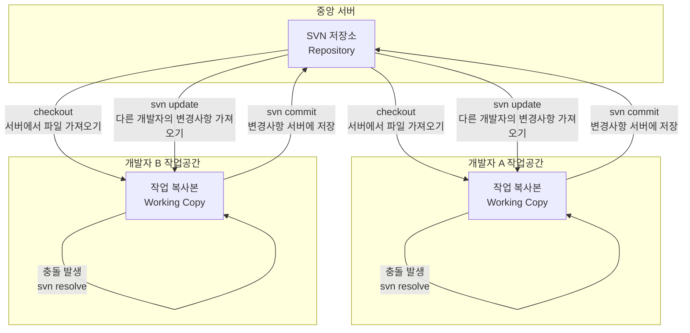

SVN(Subversion)은 2000년에 출시된 중앙 집중식 버전 관리 시스템으로, CVS(Concurrent Versions System)의 여러 한계점을 극복하기 위해 개발되었습니다.

# 핵심 특징

1. **중앙 집중식 구조**: 모든 버전 정보가 중앙 서버에 저장되며, 개발자들은 필요한 파일만 로컬에 다운로드하여 작업합니다.
2. **원자적 커밋**: 여러 파일에 대한 변경 사항이 하나의 트랜잭션으로 처리되어, 일부만 적용되는 상황이 발생하지 않습니다.
3. **디렉토리 버전 관리**: 파일뿐만 아니라 디렉토리 구조의 변경 사항도 추적합니다.
4. **효율적인 분기와 태그**: CVS보다 효율적인 분기(branch)와 태그(tag) 기능을 제공합니다.
5. **이진 파일 지원**: 텍스트 파일뿐만 아니라 이진 파일의 변경 사항도 효율적으로 관리합니다.

# Git과의 주요 차이점
- SVN과 Git의 결정적인 차이는 Local Repository가 있고 없음이다.
	
	출처: [http://www.realhanbit.co.kr/books/230/pages/2218/preview](http://www.realhanbit.co.kr/books/230/pages/2218/preview)

|특성|SVN|Git|
|---|---|---|
|구조|중앙 집중식|분산형|
|작업 방식|항상 서버 연결 필요|오프라인 작업 가능|
|저장소|중앙 서버에만 전체 이력 존재|모든 클론에 전체 이력 존재|
|브랜치|서버에 별도 디렉토리로 관리|가볍고 로컬에 생성 가능|
|속도|네트워크 의존적|로컬 작업 빠름|
|저장 방식|변경 사항(델타) 중심|스냅샷 중심|
